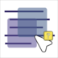
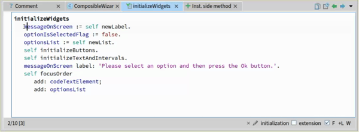
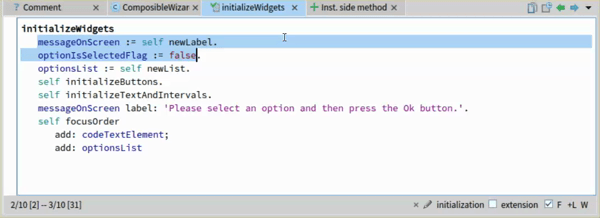
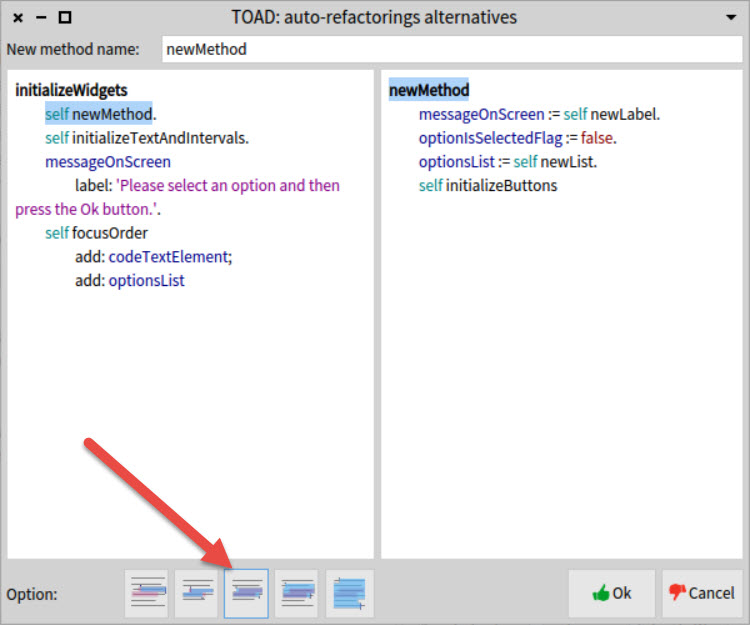
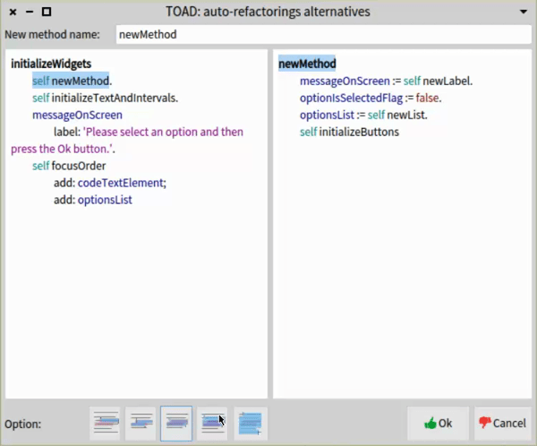
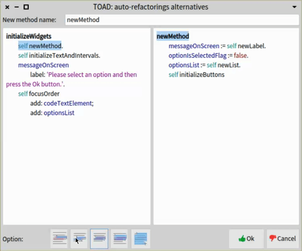

#   TOAD- HOW TO USE 
## Prerequisites 
 - Have Pharo 7 already installed in your computer
 - Download this package using iceberg to your pharo image
## HOW TO USE
### Step 1: Select the section of code that you would like to extract in a new method
 
### Step 2: Open TOAD
 - Right click in selection
 - Select "Refactoring suggestion" option
 - Click on "Extract method suggestion"

 

### Step 3: SELECT AN OPTION AND NEW'S FUNCTION NAME
 - By default, the selection option selected is the one from the middle (this one is considered as the nearest valid selection related with the original one)

 

 - You can navigate through the options in order to find a bigger selection (By selecting the right options)

 

 - And also you can navigate through the options in order to find a smaller selection (By selecting the left options)

 

- After selecting the desired option, type the desired name.
- Then press ctrl+s in order to update the new method's name.

 

 - Then the section will be replaced with a call to the new method, and a new method will be created:

 

### Observations:
 - When there are not enough available options the buttons will be displayed as disabled:
 
 
