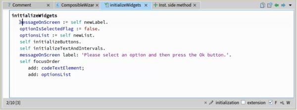
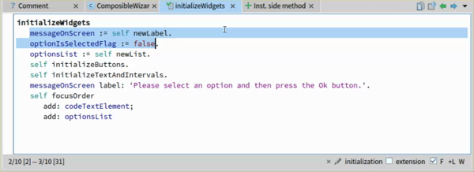
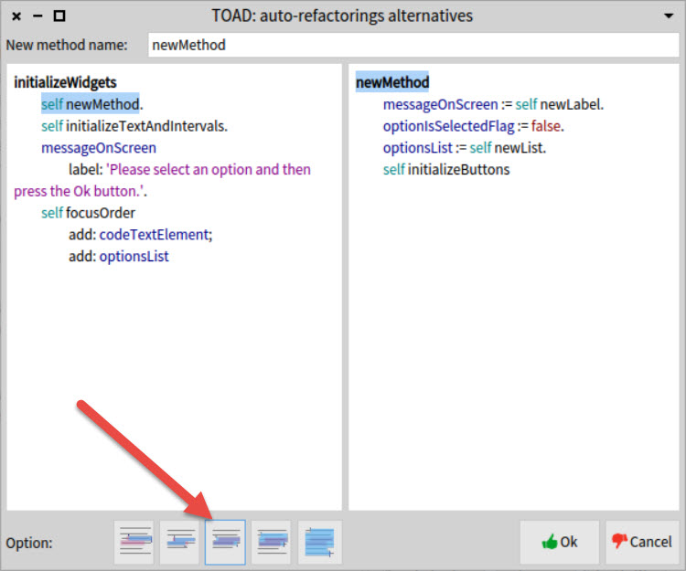
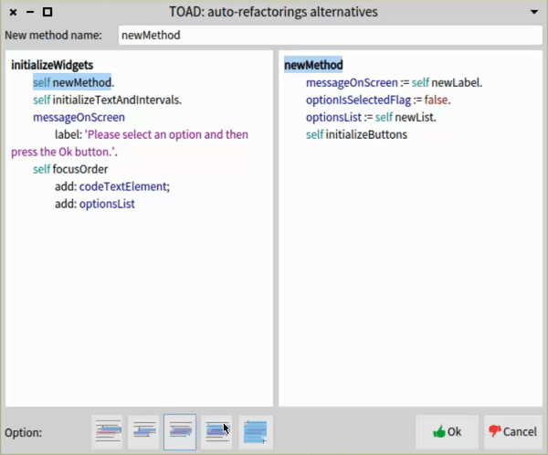
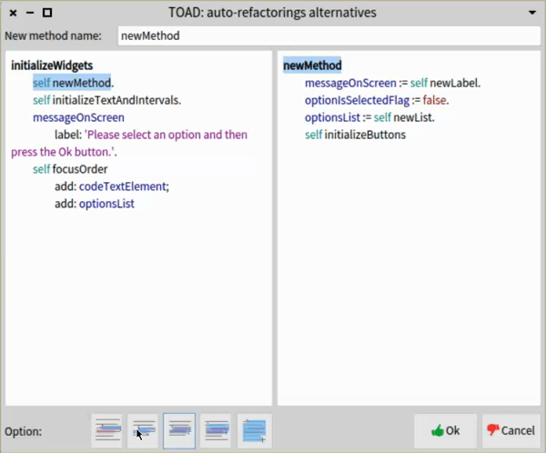

#   TOAD- HOW TO USE 
## Prerequisites 
 - Have Pharo 7 already installed in your computer
 - Download this package using iceberg to your pharo image
## HOW TO USE
### Step 1: Select the section of code that you would like to extract in a new method
 
### Step 2: Open TOAD
 - Right click in selection
 - Select "Refactoring suggestion" option
 - Click on "Extract method suggestion"

 

### Step 3: SELECT AN OPTION AND NEW'S FUNCTION NAME
 - By default, the selection option selected is the one from the middle (this one is considered as the nearest valid selection related with the original one)

 

 - You can navigate through the options in order to find a bigger selection (By selecting the right options)

 

 - And also you can navigate through the options in order to find a smaller selection (By selecting the left options)

 

#  DATA SET

## Replication Study
| `Participant` | `Number of attempts`| `Total attempts changed as expected`|`Link to video(s)`|
|---------------|---------------------|-------------------------------------|------------------|
| P1 |14| 7|<a href="https://drive.google.com/open?id=1zLTzUZaeAdyRUUA7mEDLCe5oGOuummMn"> Video and Resume (P1)</a >|
| P2 | 7| 2|<a href="https://drive.google.com/open?id=1j5sMOL6KHKtig1d5yKjxWd_8e8kxn-gb"> Video and Resume (P2) </a >|
| P3 | 7| 7|<a href="https://drive.google.com/open?id=1qNqUByk06pcUYHkJG6xCm33xlCobKmDb"> Video and Resume (P3) </a >|
| P4 |16| 8|<a href="https://drive.google.com/open?id=17hgCapkZp6MD0mmWSXnNTHafyf2Sq95j"> Video and Resume (P4) </a >|
| P5 |14| 7|<a href="https://drive.google.com/open?id=1JK7DJjtPGjXbRYLJq3Kwn3EbTbdDCmSg"> Video and Resume (P5) </a >|
| P6 | 8| 4|<a href="https://drive.google.com/open?id=1GrWV4QW_JZgd7aCUC3xhS0VEsgDjgc3A"> Video and Resume (P6) </a >|
| P7 |16|13|<a href="https://drive.google.com/open?id=1YCW0-vUxJwQVecEDB_R520pFI0nkj39b"> Video and Resume (P7) </a >|
| P8 | 9| 5|<a href="https://drive.google.com/open?id=1H59iHSiSxbebLpj-0Our-WJUI0bdC0pn"> Video and Resume (P8) </a >|
| P9 | 9| 5|<a href="https://drive.google.com/open?id=1lj_8XtZAsy9_-PfJ9bpwuqsuImZvHAWr"> Video and Resume (P9) </a >|
| P10 |14| 0|<a href="https://drive.google.com/open?id=1gdmKf2vqivK4yXaRUbp7juCzc_WV1U89"> Video and Resume (P10) </a >|
## Controlled experiment
| `Participant` |`Link to video(s)`|
|---------------|------------------|
| P1 | <a href="https://drive.google.com/open?id=1gx795fnfAi0evR8HbBA4K6wYSptJLe4Y"> Videos (P1)</a >|
| P2 | <a href="https://drive.google.com/open?id=1IKurBoQTs1naeI52Z5CqHru4FqsCRFB8"> Videos (P2)</a >|
| P3 | <a href="https://drive.google.com/open?id=1YWr7oxHj6J6ERP0PZ5ZkXD3gjtuFyjNd"> Videos (P3)</a >|
| P4 | <a href="https://drive.google.com/open?id=11_KfX1o6zrarlUaW-g-UwfsaR1YnzpTt"> Videos (P4)</a >|
| P5 | <a href="https://drive.google.com/open?id=1wEKEyksglPGT4u80KxEnJ6Uv9Cu7xAFL"> Videos (P5)</a >|
| P6 | <a href="https://drive.google.com/open?id=1OH6eYr1JmqnvzhvRA_zl94q-e_JcHYjz"> Videos (P6)</a >|
| P7 | <a href="https://drive.google.com/open?id=178YVzHRXp8b3gTE6FnmVKkmir4CpCw_P"> Videos (P7)</a >|
| P8 | <a href="https://drive.google.com/open?id=1F38tGS4Q2R3AbAdGggxA2CMlU1LStYRL"> Videos (P8)</a >|
| P9 | <a href="https://drive.google.com/open?id=1XUGkvcU760crzKGwiDFb-AyvedpneCty"> Videos (P9)</a >|
| P10 | <a href="https://drive.google.com/open?id=1GCOYQzkI4oD4vBsd7TPj_6buPNf_oPNz"> Videos (P10)</a >|